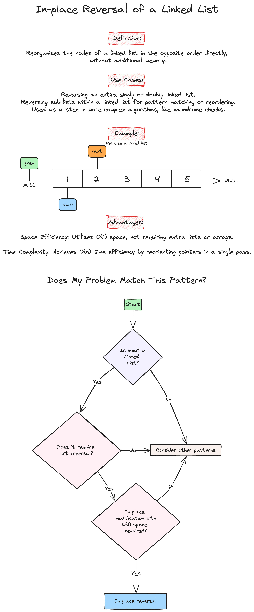

# Week 3: Linked Lists & Matrices

Welcome to the third week of our LeetCode Bootcamp. This week, we will dive into Linked Lists and Matrices in Python, alongside introducing powerful problem-solving patterns.

## Class Agenda (2 Hours)

### 1. Python Overview of Linked Lists and Matrices

Please review the following resources:

- [Programiz: Linked List](https://www.programiz.com/dsa/linked-list)
- [Datacamp: Linked List](https://www.datacamp.com/tutorial/python-linked-lists)
- [Programiz: Matrix](https://www.programiz.com/python-programming/matrix)
- [Python.org: List Data Structure](https://docs.python.org/3/tutorial/datastructures.html)

### 2. Pattern Introduction

- Fast and Slow Pointers 

- In-place Reversal of a Linked List 

- Matrices 

### 3. Problems Covered This Week

- [Middle of linked list](https://leetcode.com/problems/middle-of-the-linked-list/description/)

```python
class Solution:
    def middleNode(self, head):
        fast = head
        slow = head
        while fast and fast.next is not None:
            slow = slow.next
            fast = fast.next.next
        return slow

# Time complexity: O(n), where n is the number of nodes in the linked list.

# Space complexity: O(1) since we only use a constant amount of extra space for the pointers.
```

- [Reverse linked list](https://leetcode.com/problems/reorder-list/description/)

```python
class Solution:
    def reverseList(self, head: Optional[ListNode]) -> Optional[ListNode]:
            # Initialize three pointers: curr, prev and next
            curr = head
            prev = None

            # Traverse all the nodes of Linked List
            while curr is not None:
                # Store next
                next_node = curr.next

                # Reverse current node's next pointer
                curr.next = prev

                # Move pointers one position ahead
                prev = curr
                curr = next_node

            # Return the head of reversed linked list
            return prev

# Time complexity: O(n), where n is the number of nodes in the linked list.

# Space complexity: O(1) since we only use a constant amount of extra space for the pointers.
```

- [Reorder List](https://leetcode.com/problems/reorder-list/description/)

```python
class Solution:
    def reorderList(self, head: Optional[ListNode]) -> None:
        """
        Do not return anything, modify head in-place instead.
        """
        if not head:
            return head

        # Find the middle of the linked list using the fast and slow pointers
        slow = fast = head
        while fast and fast.next:
            slow = slow.next
            fast = fast.next.next

        # Reverse the second half of the linked list using in-place reversal
        prev, curr = None, slow
        while curr:
            curr.next, prev, curr = prev, curr, curr.next

        # Merge the first half and the reversed second half
        first, second = head, prev
        while second.next:
            first.next, first = second, first.next
            second.next, second = first, second.next

        return head

# Time complexity: O(n), where n is the number of nodes in the linked list.

# Space complexity: O(1) since we only use a constant amount of extra space for the pointers.
        

```

- [Valid Sudoku](https://leetcode.com/problems/valid-sudoku/description/)

```python
class Solution(object):
    def isValidSudoku(self, board):
        cols = collections.defaultdict(set)
        rows = collections.defaultdict(set)
        squares = collections.defaultdict(set)
        
        for r in range(9):
            for c in range(9):
                if board[r][c] == ".":
                    continue
                if (board[r][c] in rows[r] or 
                    board[r][c] in cols[c] or 
                    board[r][c] in squares[(r//3,c//3)]):
                    return False
                cols[c].add(board[r][c])
                rows[r].add(board[r][c])
                squares[(r//3,c//3)].add(board[r][c])
        return True
```

- [Rotate Image](https://leetcode.com/problems/rotate-image/description/)

```python
class Solution(object):
    def rotate(self, matrix):
        self.transpose(matrix)
        self.reflect(matrix)

    def transpose(self, matrix):
        n = len(matrix)
        for i in range(n):
            for j in range(i + 1, n):
                matrix[j][i], matrix[i][j] = matrix[i][j], matrix[j][i]

    def reflect(self, matrix):
        n = len(matrix)
        for i in range(n):
            for j in range(n // 2):
                matrix[i][j], matrix[i][-j - 1] = (
                    matrix[i][-j - 1],
                    matrix[i][j],
                )
```

## Take-Home Problems

To help solidify your understanding and practice further, here are some take-home problems:

1. [Palindrome Linked List](https://leetcode.com/problems/palindrome-linked-list/description/)
2. [Remove Nth Node From End of List](https://leetcode.com/problems/remove-nth-node-from-end-of-list/)
3. [Set Matrix Zeroes](https://leetcode.com/problems/set-matrix-zeroes/description/)

Good luck, and happy coding!
