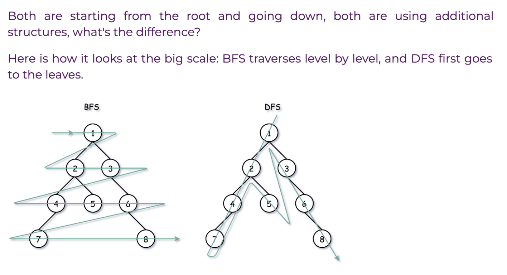

# Week 7: Search Algorithms: Binary Search, DFS, BFS

Welcome to the seventh week of our LeetCode Bootcamp. This week, we will dive into Search Algorithms DFS, BFS, BST in Python, alongside introducing powerful problem-solving patterns.

## Class Agenda (2 Hours)

### 1. Python Overview of Search Algorithms: Binary Search, DFS, BFS

Please review the following resources:

- [Programiz: Binary Search](https://www.programiz.com/dsa/binary-search)
- [Programiz: DFS](https://www.programiz.com/dsa/graph-dfs)
- [Programiz: BFS](https://www.programiz.com/dsa/graph-bfs)

BFS vs DFS 

## Take-Home Problems

To help solidify your understanding and practice further, here are some take-home problems:

1. [Binary Tree Right Side View](https://leetcode.com/problems/binary-tree-right-side-view/description/)
2. [Rotting oranges](https://leetcode.com/problems/rotting-oranges/description/)
3. [Course Schedule II](https://leetcode.com/problems/course-schedule-ii/description/)

Good luck, and happy coding!
